# TutorSight

### A website to help students find the help they need.

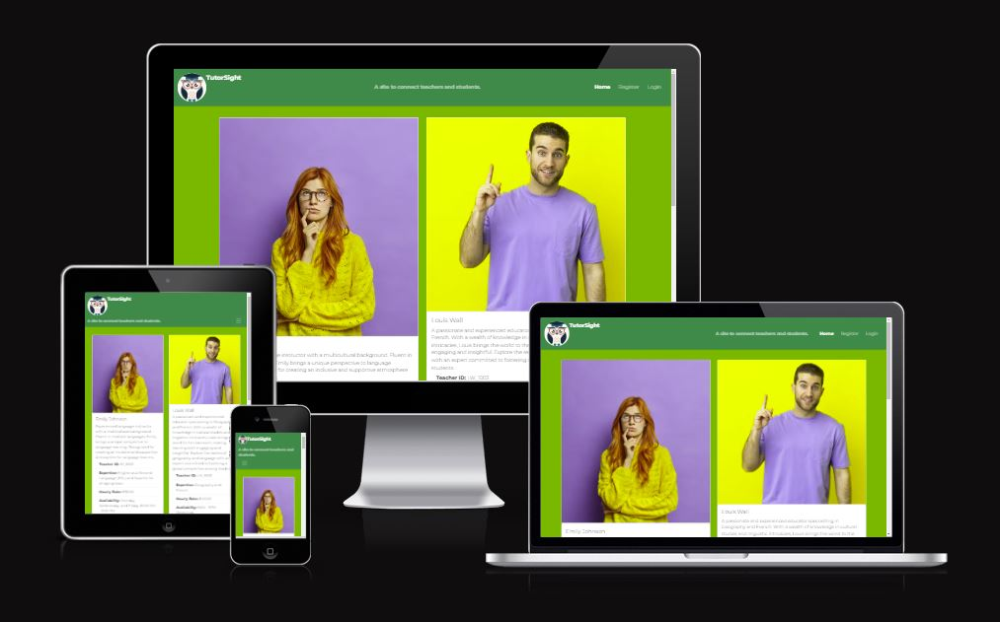

Portfolio 4 project as part of the Diploma in Full Stack Software Development by Code Institute.
___

TutorSight is an innovative online platform designed to seamlessly connect students with experienced teachers. The platform serves as a bridge between learners seeking personalized educational support and skilled educators offering their expertise. TutorSight facilitates the exploration of diverse subjects, providing a space where students can find the right teacher based on their specific needs. Whether it's academic assistance, skill development, or specialized knowledge, TutorSight empowers users to engage in one-on-one sessions with qualified teachers, fostering a collaborative and tailored learning experience. With user-friendly features and a commitment to educational excellence, TutorSight aims to enhance the accessibility and effectiveness of remote learning, creating a dynamic environment for knowledge-sharing and academic growth.

TutorSight is a comprehensive full-stack website that enables users to explore detailed tutor profiles, share reviews, and engage in discussions on various subject topics. Through its user-friendly interface, TutorSight offers a seamless experience for individuals to discover expert tutors, provide valuable feedback through reviews, and actively participate in conversations related to specific subjects.

Link to live site - [https://tutorsight-django-project-fa74b7b42ae2.herokuapp.com/](https://tutorsight-django-project-fa74b7b42ae2.herokuapp.com/)

## CONTENTS

- [TutorSight](#TutorSight)
  - [CONTENTS](#contents)
  - [Site Objectives](#site-objectives)
- [User Experience/UX](#user-experienceux)
  - [Target Audience](#target-audience)
  - [User Stories](#user-stories)
    - [New Visitor Goals](#new-visitor-goals)
    - [Existing Visitor Goals](#existing-visitor-goals)
- [Design Choices](#design-choices)
  - [Colour Scheme](#colour-scheme)
  - [Typography](#typography)
  - [Logo and Favicon](#logo-and-favicon)
  - [Wireframes](#wireframes)
  - [Flow Diagram](#flow-diagram)
  - [Database Plan](#database-plan)
- [Features](#features)
  - [Registration](#registration)
  - [Future Features](#future-features)
  - [Features Not Included](#features-not-included)
- [Technologies Used](#technologies-used)
- [Programming Languages, Frameworks and Libraries Used](#programming-languages-frameworks-and-libraries-used)
- [Agile](#agile)
- [Testing](#testing)
  - [Manual Testing](#manual-testing)
  - [User](#user)
  - [Bugs](#bugs)
  - [Lighthouse](#lighthouse)
  - [Validation Testing](#validation-testing)
    - [HTML \& CSS](#html--css)
  - [Python Testing](#python-testing)
  - [Deployment](#deployment)
    - [Github Deployment](#github-deployment)
    - [Creating a Fork or Copying](#creating-a-fork-or-copying)
    - [Clone](#clone)
    - [Repository deployment via Heroku](#repository-deployment-via-heroku)
    - [Deployment of the app](#deployment-of-the-app)
  - [Credits](#credits)
  - [Media](#media)
  - [Acknowledgments and Thanks](#acknowledgments-and-thanks)

___

## Site Objectives

The primary objective of the TutorSight project is to create an intuitive and user-friendly platform that connects teachers and students, fostering a dynamic learning community. Through detailed tutor profiles, reviews, and discussion forums, TutorSight aims to facilitate effective communication and collaboration between educators and learners. This project strives to provide a centralized hub where users can seamlessly explore tutor profiles, share and access reviews, and actively engage in discussions on diverse subject matters. The overarching goal is to enhance the educational experience by promoting transparency, accessibility, and a sense of community within the tutoring landscape.

My three main objectives were:

- ### Profile Exploration:

  Enable users to easily discover and explore detailed profiles of teachers, showcasing their expertise, bio, and availability.

- ### Book a Session
  Allow users to schedule an hour tutoring session at a specific date and time. 

- ### Review and Feedback:

   Facilitate a transparent and reliable system for users to leave reviews, rate tutors, and provide valuable feedback on their learning experiences.
___

# User Experience/UX

## Target Audience

- Students Seeking Tutors:

    This includes students of all levels looking for qualified and experienced tutors to enhance their learning. They seek personalized assistance and a platform that allows them to find the right teacher based on expertise and user reviews.

- Teachers Offering Tutoring Services:

    Qualified educators, professionals, and subject matter experts interested in providing tutoring services. They look for a platform to showcase their expertise, connect with students, and receive feedback to enhance their teaching skills.

- Parents/Guardians:

    Parents or guardians actively involved in their children's education. They use the platform to find suitable tutors for their children, ensuring personalized and quality education outside the traditional classroom setting.

## User Stories

### New Visitor Goals

New visitors to Tutorsight are individuals exploring the platform for the first time. They are looking for an intuitive and user-friendly interface that allows them to quickly understand the website's purpose and functionality. 
Their primary goals include 
    - Discovering available tutors
    - Understanding the review system
    - Navigating easily through the site.

### Existing Visitor Goals

Returning users are individuals who have already used Tutorsight before. 
They expect 
    - An efficient and familiar experience
    - Easy access to their saved preferences and profiles they've interacted with, and any personalized content. 
    - Return to connect with a specific tutor, leave a review, or explore new educational content.

### Students Seeking Tutors:

Students looking for tutors want a seamless experience in 
 - Finding, evaluating, and connecting with suitable tutors. 
 - Access to comprehensive tutor profiles, clear information on expertise and rates
 - An easy process for scheduling sessions. 
 - Reviews from other students play a crucial role in their decision-making process.

### Teachers Offering Tutoring Services:

Teachers providing tutoring services aim to 
 - Present their expertise effectively. 
 - To expect an easy-to-use platform for creating and managing their profiles
 - Showcasing their qualifications, availability, and receiving feedback from students. 
 - Provide a streamlined communication process with potential students.

### Parents/Guardians:

Parents or guardians seeking tutors for their children want 
 - A reliable platform to explore and select the best-fit tutors. 
 - A transparent information on tutors' qualifications, teaching styles, and user reviews. 
 - The ability to seek a secure and user-friendly registration and payment process.
___

# Design Choices

## Color palette

The color palette chosen includes shades of blue and green for a calming and professional feel.
White backgrounds and dark blue-gray elements maintain readability and a modern appearance.
Puce is used as an accent color for attention-grabbing elements.
The color scheme aims to convey trust, growth, and a positive learning environment, which aligns with the tutoring site's purpose.
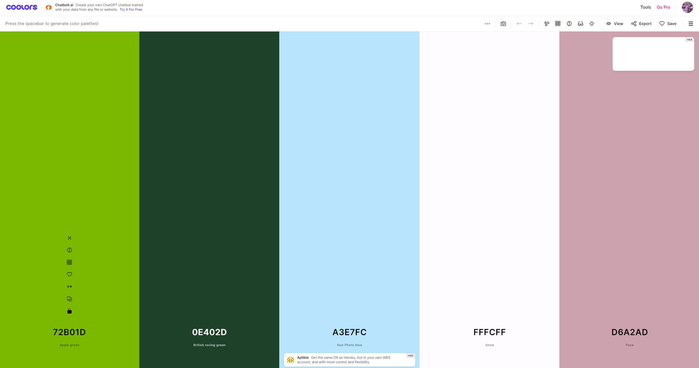

## Typography

The font family has been updated to "Montserrat" for a modern and clean look.
The font size and weight for the brand have been adjusted for better visibility.
The overall changes aim to enhance readability and maintain a professional appearance suitable for a tutoring website.

## Logo and Favicon

- The logo was created using an online logo creator - [Looka](https://looka.com/)

- The Favicon was created using an online Favicon creator - [Favicon](https://favicon.io/)

## Wireframes

- Homepage Wireframe

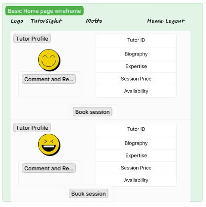

- Create Booking Wireframe

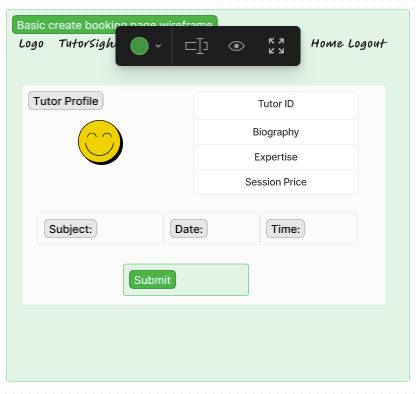

- Edit Booking Wireframe

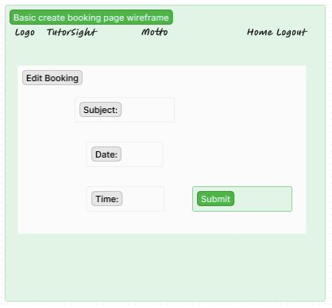

- Delete Booking Wireframe

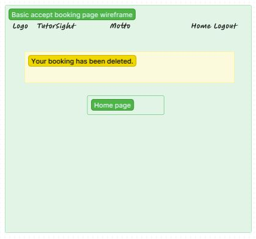

## Flow Diagram

Here is a diagram showing the possible flow through the site. There are 2 sections shown here. On the left it shows the Admin and the right shows a site user.

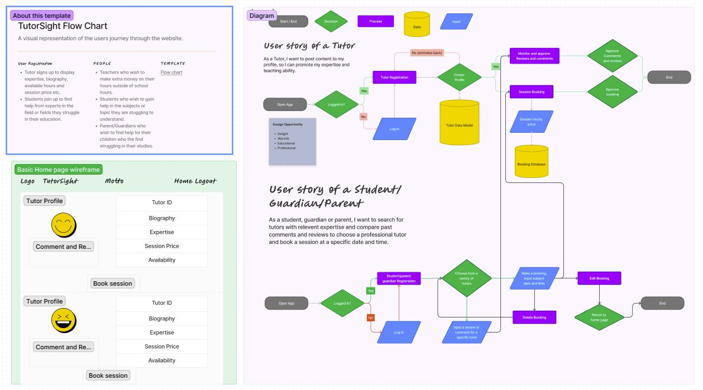

## Database Plan

The database plan is fairly simple, but it shows the information that is stored within the database, the type of data and if it is logged as a Primary or Foreign key where applicable.

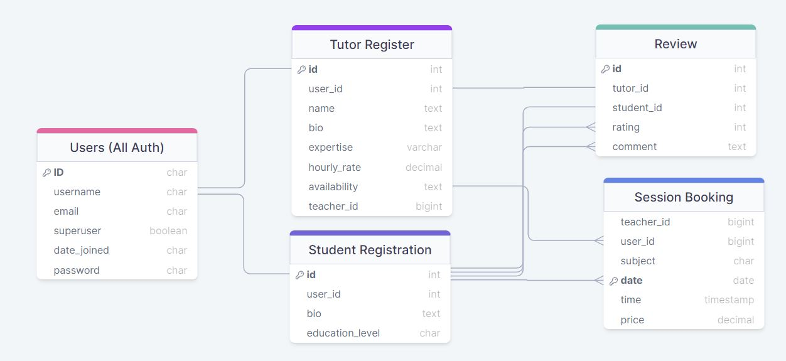

# Features

## Registration

The user can create an account

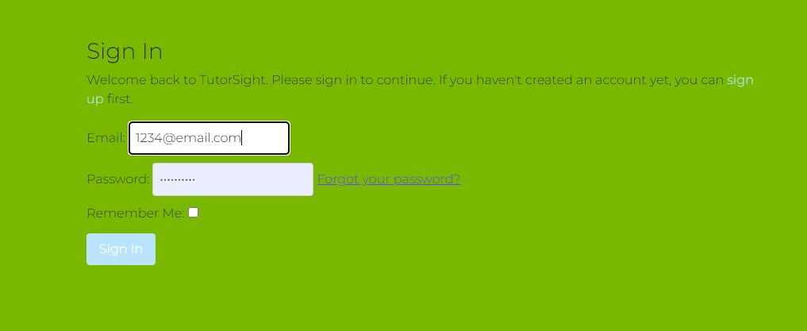

The user can logout of an account

## Session booking

The user can book a session with any tutor

The tutor can accept or deny a booked session with a student.

The user can edit previously booked session with tutor.

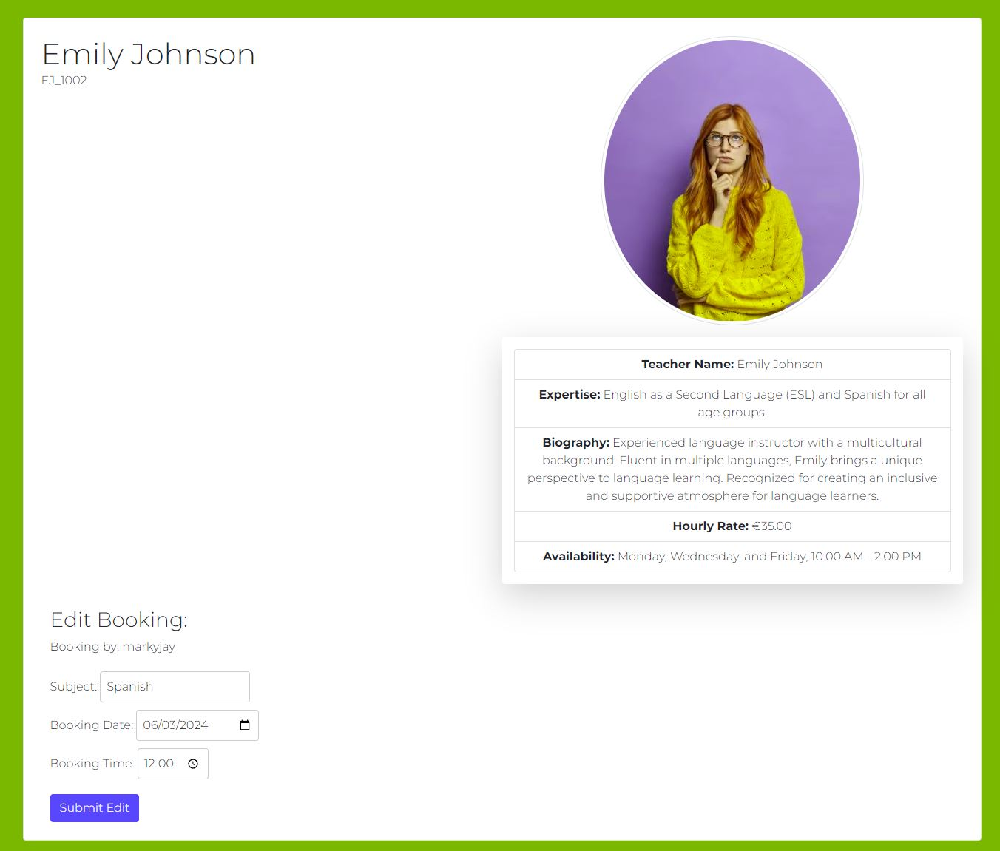

The user can delete a previously booked session with tutor

## Features not implemented

Comments and reviews have been removed due to lack of time.

## Future Features

- Advanced Search and Matchmaking:
    - Enhance the search functionality to allow students to find tutors based on specific criteria such as subject expertise, teaching style, and availability. Implement a sophisticated matchmaking algorithm to suggest tailored tutor matches for students.

- Interactive Learning Resources:

    - Introduce an interactive learning resources section where tutors can share educational materials, quizzes, and multimedia content with their students. This feature aims to enrich the learning experience and provide additional resources beyond tutoring sessions.

- Virtual Classroom Integration:

    - Implement a virtual classroom feature that allows tutors and students to conduct sessions seamlessly within the Tutorsight platform. Include tools for video conferencing, screen sharing, and a collaborative whiteboard to enhance the online tutoring experience.

- Calendar Integration and Scheduling:

    - Integrate a calendar system that enables tutors to manage their availability and students to schedule sessions directly through the platform. Provide automated reminders and notifications for upcoming sessions to ensure a smooth scheduling process.

- Gamification for Learning:

    - Introduce gamification elements to make the learning experience more engaging. Tutors can create educational games and challenges, and students can earn rewards or achievements, fostering a fun and motivating environment for learning.

- Mobile Application:

    - Description: Develop a mobile application for Tutorsight, allowing users to access the platform on their smartphones and tablets. The app will provide a seamless and responsive experience, making it convenient for users to connect with tutors and engage in learning on the go.

- Community Forums and Networking:

    - Expand the community aspect by introducing discussion forums and networking opportunities. Users can participate in educational discussions, share insights, and connect with like-minded individuals, fostering a sense of community within Tutorsight.

- Progress Tracking and Reporting:

    - Implement features for both tutors and students to track learning progress. Tutors can generate progress reports detailing achievements and areas for improvement, while students can access personalized dashboards to monitor their learning milestones.

- Language Support and Localization:

    - Provide language support for multiple languages, making Tutorsight accessible to a broader audience. Additionally, consider localization features to tailor content and experiences based on users' geographic locations and cultural preferences.

- Enhanced Review and Rating System:

    - Enhance the review and rating system to include detailed feedback categories, allowing for more nuanced evaluations. Implement a verified review system and badges for outstanding tutors to increase credibility and trust within the Tutorsight community.

___

# Technologies Used

Here are the technologies used to build this project:

- [Gitpod](https://gitpod.io/) To build and create this project
- [Github](https://github.com) To host and store the data for the site.
- [PEP8 Validator](https://pep8ci.herokuapp.com/) Used to check python code for errors
- [ElephandSQL](https://www.elephantsql.com/) Used to store PostgreSQL database.
- [Cloudinary](https://cloudinary.com/) Used as cloud storage for images uploaded as part of the blog posts
- [Heroku](https://id.heroku.com/) Used to deploy the project

# Programming Languages, Frameworks and Libraries Used

- [HTML](https://developer.mozilla.org/en-US/docs/Web/HTML)
- [CSS](https://developer.mozilla.org/en-US/docs/Learn/Getting_started_with_the_web/CSS_basics)
- [Python](https://en.wikipedia.org/wiki/Python_(programming_language))
- [Django](https://www.djangoproject.com/)
- [Bootstrap](https://getbootstrap.com/)

# Agile

This project was designed using Agile methodology, utilising the Project Board and Issues sections in GitHub

- [Project Board](https://github.com/users/Markyjay/projects/4)

# Testing

As each section or Function/Model was built during this project, I was testing for functionality and styling issues that may have arisen (see table below), which were corrected or fixed before continuing. I also had friends test the site by signing up, adding and deleting comments using various devices on varying platforms (IOS, Android, Mobile, Tablet etc) and reporting back any issues they encountered with functionality or styling.

## Manual Testing

*For any Fails, there is a more detailed description below the table*

ADMIN
| TEST | OUTCOME | PASS/FAIL|
|:---:|:---:|:---:|
| Create a Booking | Book a session successfully | PASS |
| Edit a previous booking | Only able to implement edit directly after its creation | PASS |
| Confirm a booking | Did not have enough time to implement this | FAIL |
| Delete Booking | Booking deletes successfully | PASS |
| Write a comment | Could manually enter comments using admin | PASS |
| Delete User Comments | Could manually delete comments using admin | PASS |
| Delete Review | Could manually delete reviews using admin | PASS |
| Create 7 Test Posts to check Pagination | Next/Previous Page Appears at bottom of screen | PASS |

(*) - Due to securing a new position in November my time that I could allocate to this project diminished significantly and I got stuck at many points along the way, It was only in the last few weeks that I was starting to understand python and had very little if any experience with bootstrap. Implementing models connecting views and urls properly was very difficult when creating a new type of model from what was shown in the walkthrough, I made things very difficult for myself unintentionally. If i could go back I would certainly prepare better and with the knowledge I have now I could create a much better project. I know myself this is a substandard attempt I only wish you see the effort I made and I hope it merits a pass. 

## User

| TEST | OUTCOME | PASS/FAIL|
|:---:|:---:|:---:|
| Create Account | Created successfully | Pass |
| Login | Login Successful | PASS |
| Logout | Logout Successful | PASS |
| Create a Booking | Book a session successfully | PASS |
| Edit a previous booking | Only directly after creation | PASS |
| Confirm a booking | Did not have enough time to implement this | FAIL |
| Delete Booking | Booking deletes successfully | Pass |
| Write a comment | Ran out of time to implement this feature | FAIL |
| Delete User Comments | Ran out of time to implement this feature | FAIL |
| Delete Review | Ran out of time to implement this feature | FAIL |
| Filter Posts by category | Ran out of time to implement this feature | FAIL |

(*) See Bugs below

## Bugs

PostgreSQL Version Mismatch Error:

- Issue: Django was expecting PostgreSQL version 12 or later, but PostgreSQL 11.18 was found.
  Fix: Ensure that you are using PostgreSQL version 12 or later. Check your database configuration.
  TemplateSyntaxError in Django:

- Issue: TemplateSyntaxError at /booking/AC_1001/new/: Invalid block tag 'endif', expected 'endblock'.
  Fix: Check the template file at line 51 for correct block tags. Ensure proper usage of  and .
  TemplateDoesNotExist Error - tempus_dominus/widget.html:

- Issue: Django couldn't find the template file tempus_dominus/widget.html.
  Fix: Ensure that the required template file tempus_dominus/widget.html is available in the specified location or install the required package if it's part of a third-party library.
  Prepopulating Form Data in Django View:

- Issue: Form data was not prepopulating in the Django edit view.
  Fix: Ensure that you pass the instance of the object to the form in the view. Example: form = BookingForm(instance=booking).
  KeyError in Django:

- Issue: KeyError at /booking/AC_1001/new/: 'booking_time'.
  Fix: Check if the form is correctly defining the field 'booking_time' and ensure it's present in the submitted data.
  OperationalError - PostgreSQL Connection Issue:

- Issue: OperationalError at /: Connection to PostgreSQL server failed due to password authentication failure.
  Fix: Double-check the database credentials, especially the password, in your Django settings. Ensure they match the credentials provided by your PostgreSQL service.
  TemplateDoesNotExist Error - accept_booking.html:

- Issue: Django couldn't find the template file accept_booking.html.
  Fix: Create the template file accept_booking.html in the specified location or adjust the template reference.
  Reverse for 'edit_booking' Error:

- Issue: Reverse for 'edit_booking' with arguments '('',)' not found.
  Fix: Ensure that the edit_booking URL pattern in urls.py expects an integer parameter and check the value being passed in the template.

- Issue: In the accept_booking.html page, there was an issue with the "Edit Booking" functionality. Initially, a form tag was used for the button, causing unexpected behavior and preventing the display of stored content when editing a booking.
  Fix: The issue was resolved by changing the implementation to use a hyperlink (<a> tag) with the appropriate URL pointing to the edit_booking view. This adjustment ensures a smoother user experience, allowing users to navigate directly to the edit page without the need for a form submission.

## Lighthouse

The performance scores appear to be low, and I believe this is due to the images uploaded for each blog post being hosted on a third-party cloud-based platform.

Desktop

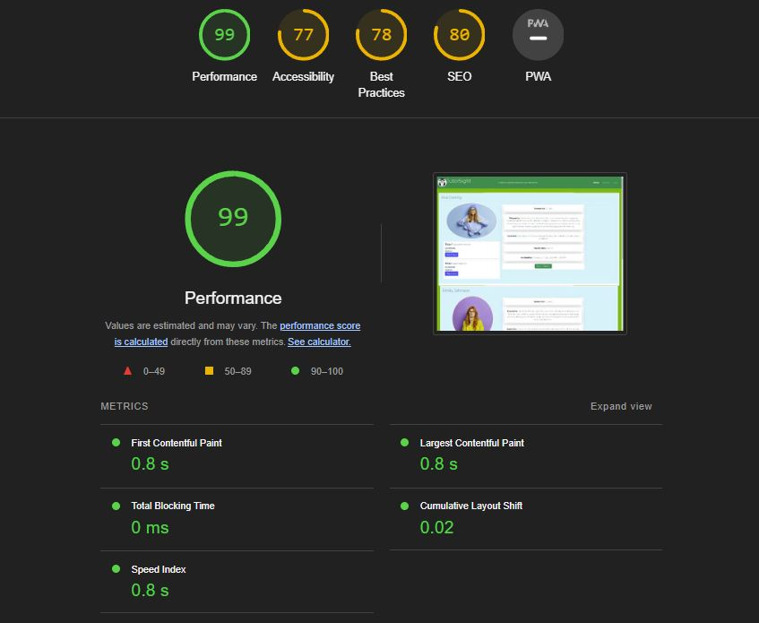

## Validation Testing

### HTML & CSS

HTML & CSS testing was completed using [W3 Validator](https://validator.w3.org/)

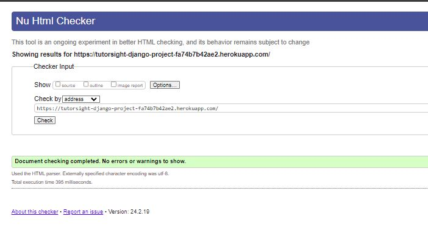

## Python Testing

Python pep8 validation was done via [Code Institute's Python Linter](https://pep8ci.herokuapp.com/)

The only errors recieved here were where some lines of text exceeded the limit of 79 characters, but these have now been rectified.
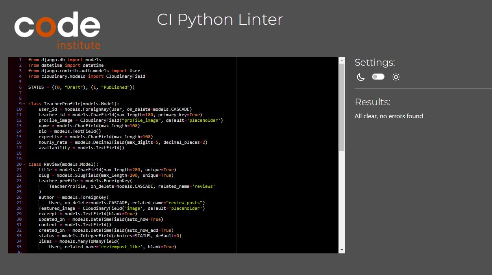

Python Files Tested:

- models
- forms
- views
- urls

___

## Deployment

### Github Deployment

The website was stored using GitHub for storage of data and version control. To do this I did the following;

After each addition, change or removal of code, in the terminal within your IDE (I used codeanywhere for this project) type:

- git add .
- git commit -m "meaningful commit message"
- git push

The files are now available to view within your github repository.

### Repository deployment via Heroku

- On the [Heroku Dashboard](https://dashboard.heroku.com) page, click New and then select Create New App from the drop-down menu.
- When the next page loads insert the App name and Choose a region. Then click 'Create app'
- In the settings tab click on Reveal Config Vars and add the key Port and the value 8000. The credentials for this app were:

1. Cloudinary URL
2. Postgres Database URL
3. DISABLE_COLLECTSTATIC
4. Port (8000)
5. SECRET_KEY

- Below this click Add buildpack and choose python and nodejs in that order.

### Deployment of the app

- Click on the Deploy tab and select Github-Connect to Github.
- Enter the repository name and click Search.
- Choose the repository that holds the correct files and click Connect.
- A choice is offered between manual or automatic deployment whereby the app is updated when changes are pushed to GitHub.
- Once the deployment method has been chosen the app will be built and can be launched by clicking the Open app button which should appear below the build information window, alternatively, there is another button located in the top right of the page.
___

## Credits

This project was based on the Code Institute's - I think therefore I blog walkthrough module which provided a standard blog 'base'. From this base I customised a lot of the layout and styling with Bootstrap and custom CSS. I also added a custom model for booking a session. This allowed me to create a functionality within the site for users to filter through teachers and their reviews and comments selecting a suitable tutor if needed.

I also added several custom Views and Forms to the site, as well as ensuring that all links and desired functionality was working as intended.

For inspiration and fine-tuning of my code, I referred to John Elder's youtube channel [Codemy](https://www.youtube.com/@Codemycom) where I was able to get a better understanding of how to correctly create this type of product using Django and Bootstrap.

The wireframe mockups were created using [Figma](https://https://www.figma.com/)

Once complete, the readme file was passed through a spelling and grammar check via [Grammarly](https://www.grammarly.com/)

___

## Media

For placeholder images, I have used [picsum](https://picsum.photos/) which provides a library of stock images that display as a placeholder.

All other content and images are my own.

___

## Acknowledgments and Thanks

For inpiration in general, for code, design help and advice, I'd like to give thanks to;

Patricia Young my mother who has been encouraging and patient with me throughout the project.

Jubril my mentor at Code Institute who was very patient and generous with his time.

Kyle Clow and Stephen Dawson new friends and recent hackathon partners who have helped me throughout my project with encouragement and patience. I can not thank them enough.

Other Slack members and the code institute tutoring service were also helpful throughout the project.
